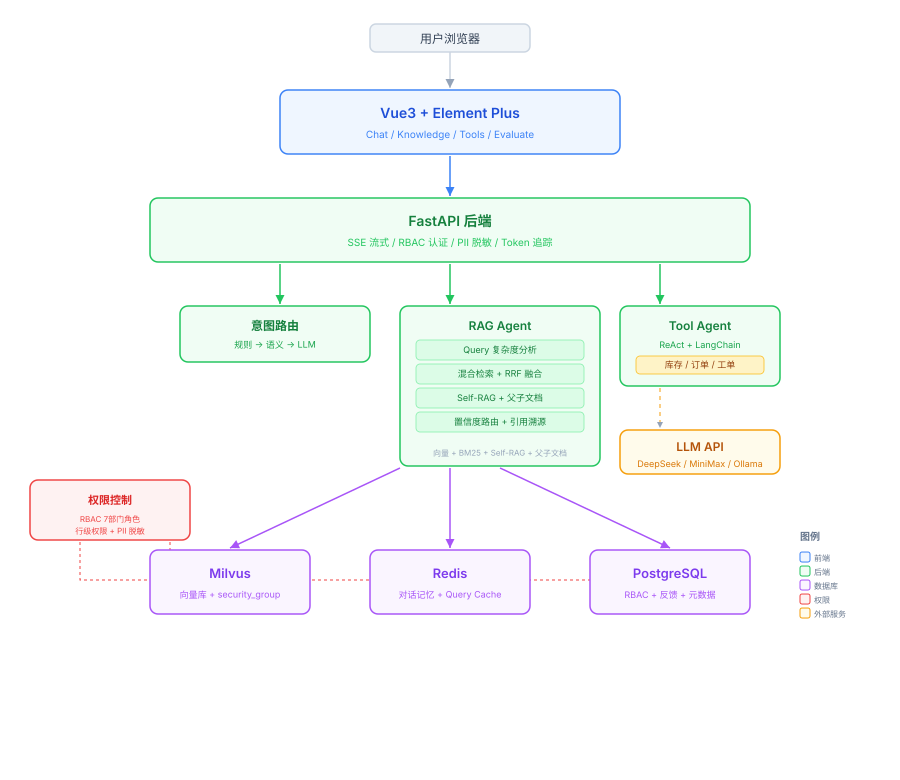

# Supply Chain QA — 供应链智能问答系统

面向制造业供应链场景的 RAG + Multi-Agent 问答助手。员工用自然语言提问，系统从知识库检索答案或调用后端系统查询实时数据。

## 技术栈

- 前端：Vue3 + Element Plus + Pinia + Vite
- 后端：Python + FastAPI + LangChain
- 向量库：Milvus（BGE-small-zh-v1.5, 512维）
- 缓存：Redis（对话记忆 + Query Cache）
- 数据库：PostgreSQL（RBAC + 反馈）
- LLM：DeepSeek API（可切换 MiniMax/Ollama）

## 架构




## 核心功能

### 意图路由（三级）

1. 规则匹配（<1ms）：关键词/正则，零延迟
2. 语义路由（<10ms）：预计算路由 embedding，余弦相似度匹配，零 token
3. LLM 分类（~2.5s）：兜底，处理复杂语义

### RAG 检索

- 混合检索：Milvus 向量 + BM25 关键词，RRF 融合排序
- Query 复杂度分析：简单查询走轻量检索，复杂查询走完整流程
- Self-RAG：LLM 判断 chunk 相关性，过滤低分噪音
- 父子文档：小 chunk 精确匹配 → 大 chunk 提供上下文
- Query Cache：MD5 key，5 分钟 TTL，LRU 淘汰

### 工具调用

- 手写 ReAct 循环（默认）：JSON 格式 Thought/Action/Observation，最多 5 轮
- LangChain AgentExecutor（可切换）：create_react_agent 标准实现
- 工具：query_inventory / query_order / create_ticket / get_datetime / get_knowledge

### 行级权限控制

- 7 个部门角色：admin / purchase / warehouse / quality / production / finance / logistics
- Milvus security_group 数组列，array_contains 过滤
- 前端上传时可选择可见部门
- 不同角色登录只能看到自己部门的文档

### 文档解析

- PDF：pymupdf4llm（结构化 Markdown，保留表格/标题）
- DOCX：python-docx（段落+表格）
- 支持格式：PDF / DOCX / TXT / MD

### 其他

- SSE 流式输出：Token 级逐字输出 + 多事件类型
- Token 成本追踪：实时显示 token 用量和费用
- DAG 可视化：SVG 绘制 RAG 流水线，7 节点实时状态
- Faithfulness：关键词覆盖率检测
- PII 脱敏：身份证/手机/邮箱等自动识别

## 快速开始

### 1. 启动基础设施

```bash
docker-compose up -d
```

### 2. 配置后端

```bash
cd backend
# 创建 .env，填入 DEEPSEEK_API_KEY
```

### 3. 启动后端

```bash
cd backend
pip install -r requirements.txt
uvicorn app.main:app --host 0.0.0.0 --port 8001
```

### 4. 启动前端

```bash
cd frontend
pnpm install
pnpm dev
# 访问 http://localhost:3000
```

### 5. 上传知识库

访问 http://localhost:3000/knowledge，上传 knowledge/ 目录下的供应链文档。

## 默认账号

| 账号 | 密码 | 角色 | 可见文档 |
|------|------|------|----------|
| admin | admin123 | 管理员 | 全部 |
| purchase | 123456 | 采购部 | 采购+供应商+物料编码+公共 |
| warehouse | 123456 | 仓库部 | 库存+物流+物料编码+公共 |
| quality | 123456 | 质量部 | 供应商+质检+公共 |
| production | 123456 | 生产部 | 物料编码+库存+生产计划+公共 |
| finance | 123456 | 财务部 | 采购+成本核算+公共 |
| logistics | 123456 | 物流部 | 库存+物流+公共 |

## 项目结构

```
supply-chain-qa/
├── backend/
│   ├── app/
│   │   ├── main.py
│   │   ├── config.py
│   │   ├── agents/
│   │   │   ├── router.py          # 意图路由
│   │   │   ├── rag.py             # RAG Agent
│   │   │   ├── tool.py            # Tool Agent
│   │   │   └── langchain_agent.py
│   │   ├── api/
│   │   │   ├── chat.py            # SSE 流式对话
│   │   │   ├── knowledge.py       # 知识库管理
│   │   │   ├── auth.py            # RBAC 认证
│   │   │   └── tool.py
│   │   ├── core/
│   │   │   ├── rag_engine.py      # RRF + Query Cache
│   │   │   ├── llm_router.py      # LLM 工厂
│   │   │   ├── milvus_client.py   # Milvus + 行级权限
│   │   │   ├── semantic_router.py # 语义路由
│   │   │   ├── query_analyzer.py  # 复杂度分析
│   │   │   ├── confidence_router.py
│   │   │   ├── self_rag.py
│   │   │   ├── faithfulness.py
│   │   │   ├── clarify.py
│   │   │   ├── retry.py
│   │   │   └── auth.py
│   │   └── models/
│   │       └── user.py
│   ├── knowledge/                 # 供应链文档
│   └── requirements.txt
├── frontend/
│   └── src/
│       ├── views/
│       ├── stores/
│       ├── api/
│       └── components/
├── docker-compose.yml
└── README.md
```

## API 接口

| 接口 | 方法 | 说明 |
|------|------|------|
| /api/v1/chat/stream | POST | SSE 流式对话 |
| /api/v1/chat/completions | POST | 非流式对话 |
| /api/v1/knowledge/upload | POST | 上传文档（支持 security_group） |
| /api/v1/knowledge/list | GET | 文档列表（按角色过滤） |
| /api/v1/auth/login | POST | 登录 |
| /api/v1/tools/list | GET | 工具列表 |
