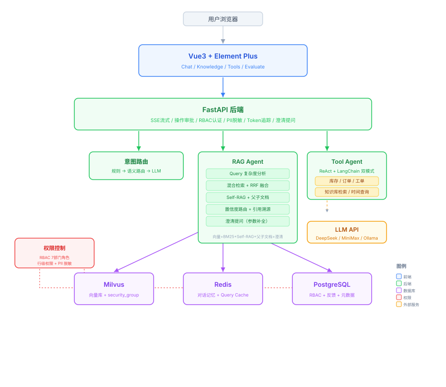

# SmartQA Pro — 供应链智能问答系统

面向制造业供应链场景的 RAG + Multi-Agent 智能问答系统。员工用自然语言提问，系统从知识库检索答案或调用业务系统查询实时数据——双链路驱动，无需切换多个后台。

**技术栈**: FastAPI + LangGraph + Milvus + Redis + Vue3 | DeepSeek API

## 架构



## 核心设计

### 意图路由（三级级联）

1. 规则匹配 <1ms：关键词/正则，拦截 70% 请求
2. 语义路由 <10ms：预计算 embedding 相似度，零 token 消耗
3. LLM 分类 ~2s：兜底复杂语义

### RAG 检索链

混合检索（Milvus 向量 + BM25 关键词）→ 自适应 RRF 权重融合 → 四层后处理（低分过滤 / Jaccard 去重 / 冲突检测）→ BGE-Reranker 精排。知识库 92 篇文档，2425 chunks，覆盖 7 个部门。

**自适应 RRF**: 精确查询（含编码/编号）→ BM25 权重 ×1.5，语义查询（含怎么/如何）→ 向量权重 ×1.5。

**四层后处理**: RRF<0.008 低分丢弃 → 相邻 Jaccard>0.7 合并 → 实体数值矛盾标记 → Self-RAG 相关性判断。

### Agent 工具调用

LangChain `bind_tools` + LangGraph `StateGraph`/`ToolNode`。6 个工具，agent↔tools 最多 5 轮收敛。

工具: `query_inventory` / `query_order` / `create_ticket` / `get_datetime` / `get_knowledge` (RAG) / `query_supplier`

benchmark: 20 次跨工具查询，100% 成功率，平均响应 1.7s（含 LLM + 工具 + 生成）。

### 行级权限

7 部门角色（admin / purchase / warehouse / quality / production / finance / logistics），Milvus ARRAY 列 `security_group` + `array_contains` 过滤。权限从 Milvus 检索层透传至 BM25 层和 Query Cache key。

### 多源冲突检测

供应链多部门文档可能对同一指标有不同定义（如安全库存 50 vs 100 件）。正则提取实体+数值 → 同实体不同值 → SSE 推送 `conflict_detected` 事件 → 冲突上下文追加到 LLM prompt，让回答主动标注矛盾而非随机选一个。

### 流式 SSE + 操作审批

Token 级逐字输出，7 种 SSE 事件类型（rag_progress / tool_status / conflict_detected / approval_request / clarify 等）。写操作（create_ticket）执行前发送审批请求，前端确认后执行。

## 快速开始

```powershell
.\demo_start.ps1
```

一键启动 Docker 基础设施 + 后端 + 前端 + 自动索引知识库。

### 手动启动

```bash
# 1. 基础设施
docker-compose up -d etcd minio milvus redis postgres

# 2. 后端 (Python 3.10+)
cd backend && cp ../.env.example .env
pip install -r requirements.txt
uvicorn app.main:app --host 0.0.0.0 --port 8001

# 3. 前端 (Node 18+)
cd frontend && pnpm install && pnpm dev
# → http://localhost:3000
```

## 默认账号

| 账号 | 密码 | 角色 | 可见范围 |
|------|------|------|----------|
| admin | admin123 | 管理员 | 全部 |
| purchase | 123456 | 采购部 | 采购/供应商/公共 |
| warehouse | 123456 | 仓库部 | 库存/物流/公共 |
| quality | 123456 | 质量部 | 供应商/质检/公共 |
| production | 123456 | 生产部 | 物料/库存/公共 |
| finance | 123456 | 财务部 | 采购/成本/公共 |
| logistics | 123456 | 物流部 | 库存/物流/公共 |

## 项目结构

```
supply-chain-qa/
├── backend/
│   ├── app/
│   │   ├── agents/           # Agent 编排
│   │   │   ├── tool.py       # LangGraph ToolAgent (213行)
│   │   │   ├── rag.py        # RAG Agent (494行)
│   │   │   └── router.py     # 意图路由 (280行)
│   │   ├── api/
│   │   │   ├── chat.py       # SSE 流式主循环 (922行)
│   │   │   ├── knowledge.py  # 知识库管理
│   │   │   └── auth.py       # RBAC 认证
│   │   └── core/
│   │       ├── rag_engine.py # RRF融合+四层后处理 (712行)
│   │       ├── milvus_client.py  # 行级权限 (439行)
│   │       ├── tool_metrics.py   # 工具调用指标 (88行)
│   │       ├── retry.py      # 流式重试 (184行)
│   │       └── ...
│   └── requirements.txt
├── frontend/                 # Vue3 + Element Plus + Pinia
├── knowledge/                # 92篇供应链文档 (1.2MB)
├── docs/                     # 面试手册 + 架构图
│   └── interview-showcase.html
├── plan/                     # 设计文档
├── scripts/                  # 部署/验证脚本
├── docker-compose.yml
└── README.md
```

## API

| 端点 | 方法 | 说明 |
|------|------|------|
| /api/v1/chat/stream | POST | SSE 流式对话 |
| /api/v1/tools/call | POST | Agent 工具调用 |
| /api/v1/knowledge/upload | POST | 上传文档 |
| /api/v1/knowledge/list | GET | 文档列表 |
| /api/v1/auth/login | POST | 登录 |
| /api/v1/tools/list | GET | 工具列表 |
